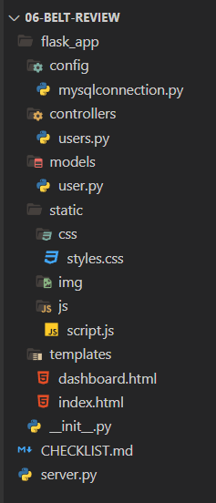

# Python Belt Exam Guidelines
I highly recommend that you prepare your exam project in advance. You should at least have a working login and registration component already tested and working. Have at least one user registered in your database.

A red belt will require implementation of a one-to-many relationship between users and some other table. This other table cannot be pre-coded, but it can be generated from a boilerplate model that you prep beforehand. Use the replace all feature in VS Code and remember to preserve case.

Once you create the second table in your ERD, seed it with at least one or two rows.

## Project Directory Structure
Screen shot of typical directory structure:

## Preparation Checklist
- [ ] Working Login/Registration
- [ ] Boilerplate model class for the child table (whatever.py)
- [ ] Boilerplate controller for the child table (whatevers.py)
- [ ] Boilerplate HTML template(s)

## Code Flow

### Create
**Prep:**
1. GET route that displays form
2. HTML template with form:
   1. Form element must have an action and a method
   2. Action defines the form processing route
   3. Method must be "POST"
   4. Every placeholder in your SQL query must be named elements in your form
   5. This includes a hidden input for the logged-in user's id (`user_id`).
   6. A submit button INSIDE the form

**Submit Flow:**
1. User submits form as POST request to processing route
2. Processing POST handler in controller receives request
3. Validator static function is called
4. Validator checks each input for validity in series of `if elif` blocks and returns a boolean value of `True` or `False`
5. Back in controller, if validator function returns `False`, redirect the user back to form and display error messages
6. Repeat steps 1-5 until validator returns `True`
7. If validator returns `True`, create new row in database by calling the `create` class method (the platform calls it `save`).
8. The `create` class method must have a SQL insert query with placeholders that match the named elements in your form
9. `connectToMySql` function is called
10. `query_db` is chained and called, and we pass the query and `form_data` to it
11. `query_db` returns the id of the row it created (this is where any SQL errors may trigger)
12. Back in controller, we can use the id that was returned from `query_db` to redirect the user to the details route
13. Or we can just redirect the user to the route that displays all (this is what will usually be the case)